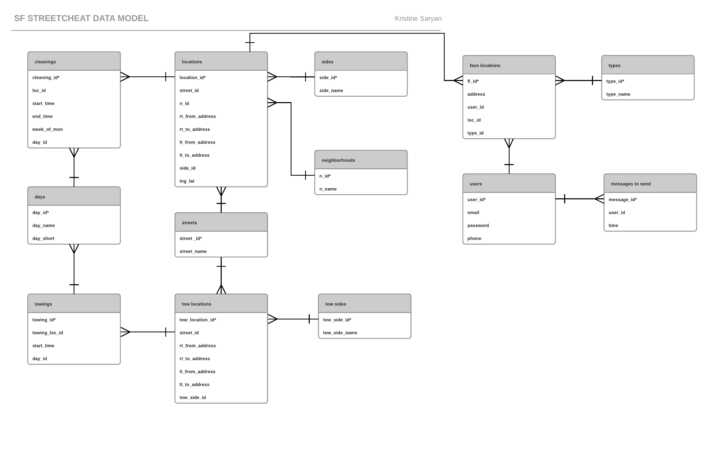
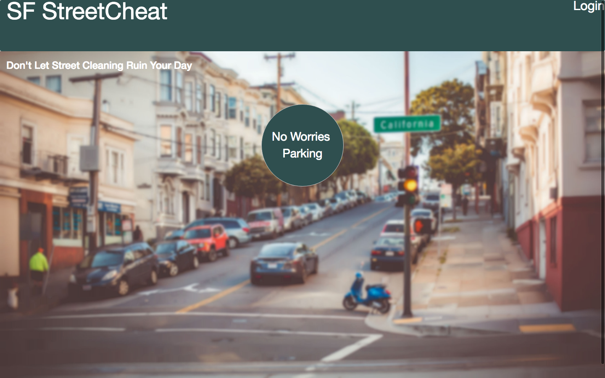
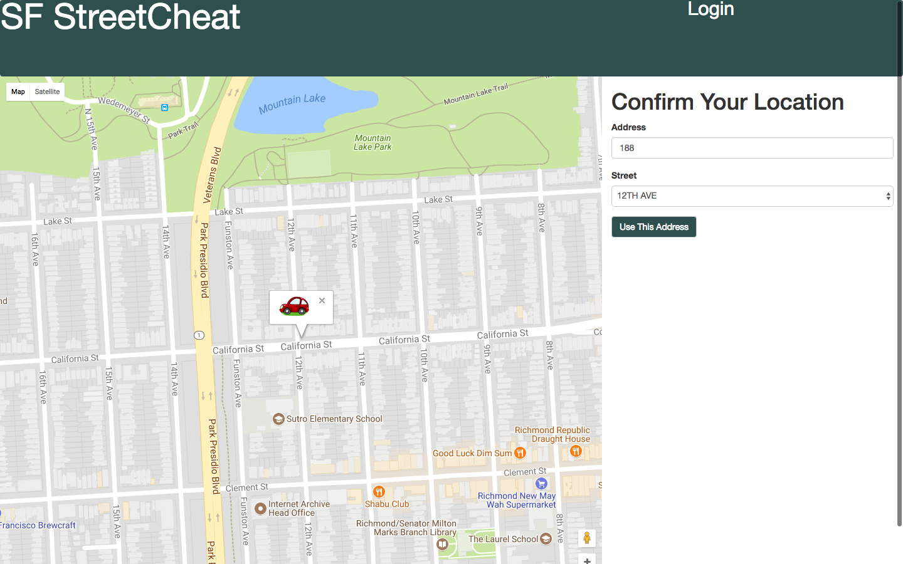
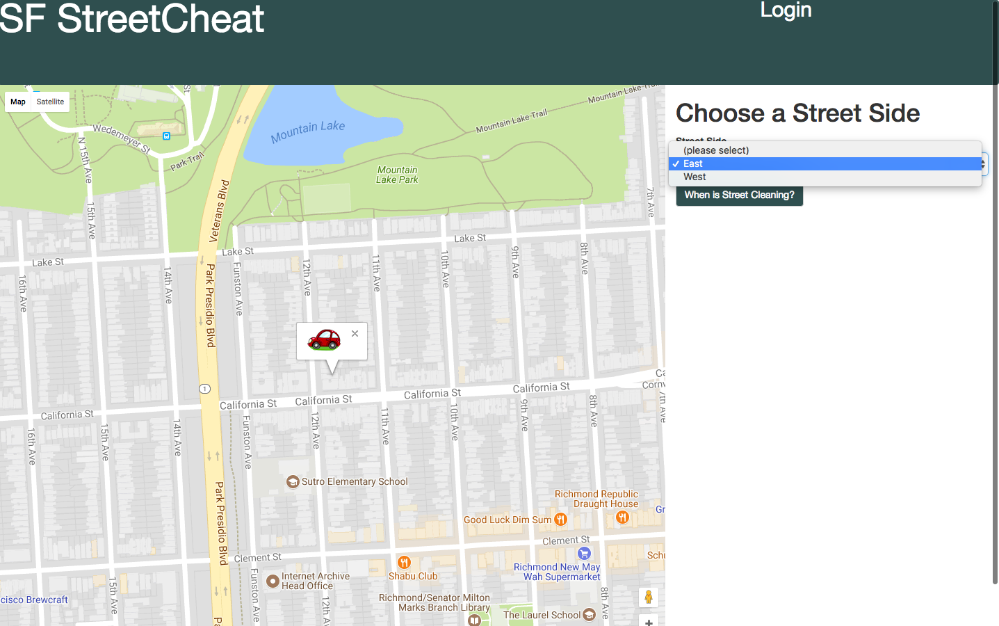
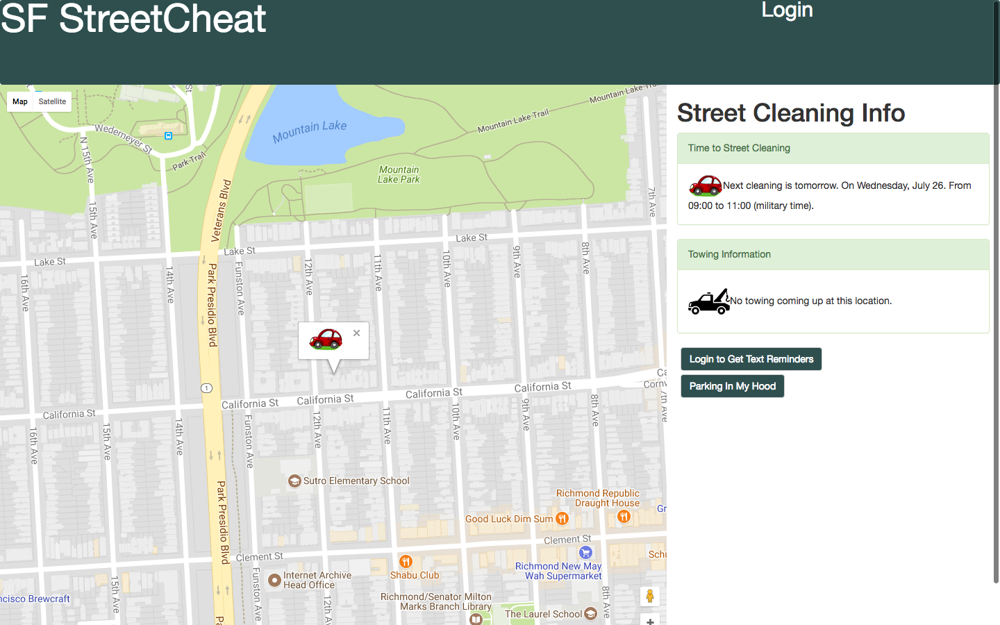
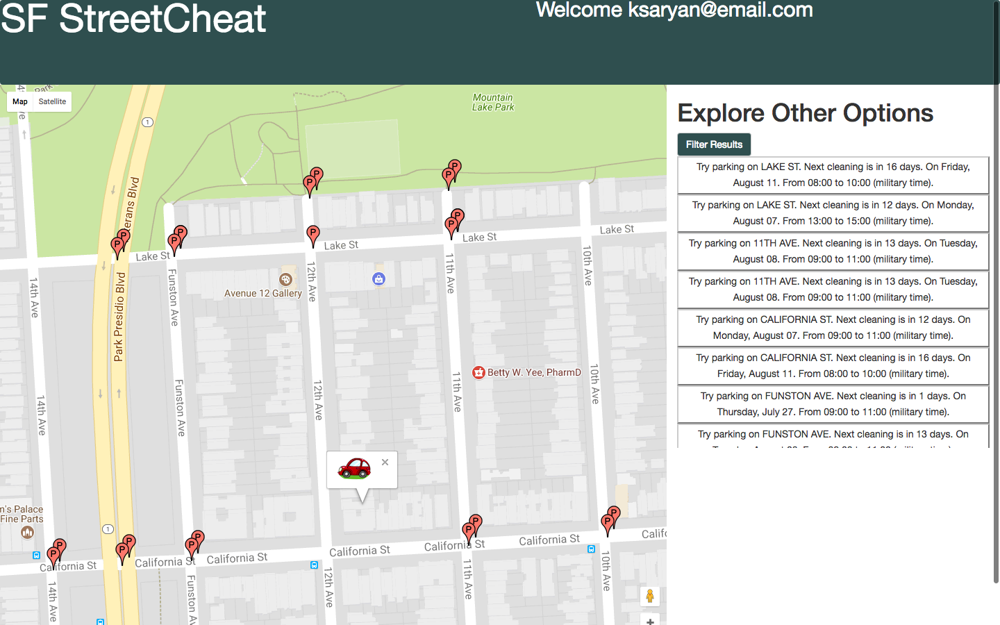
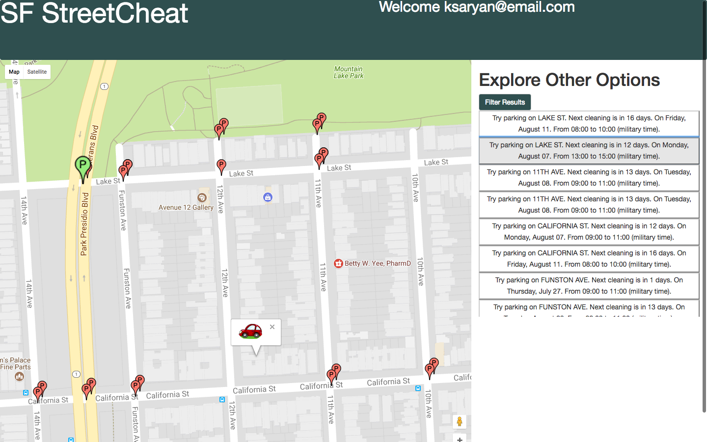
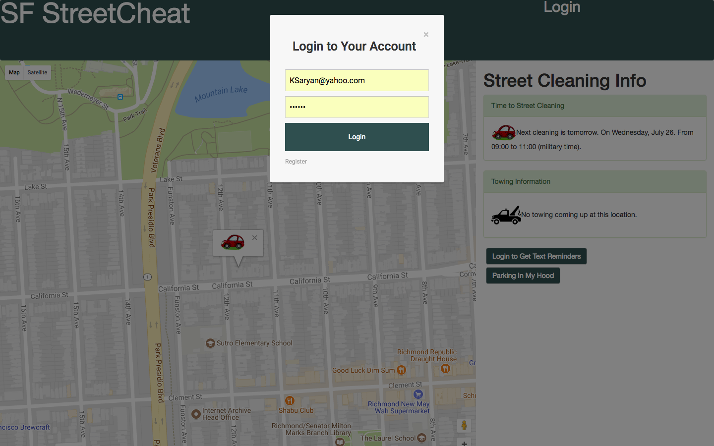
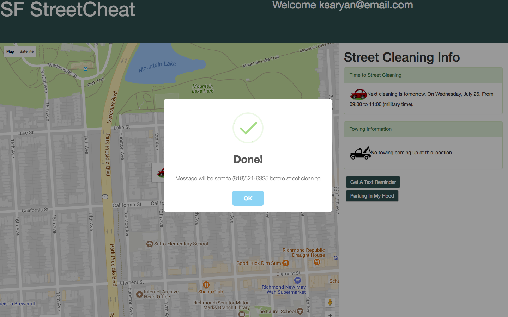
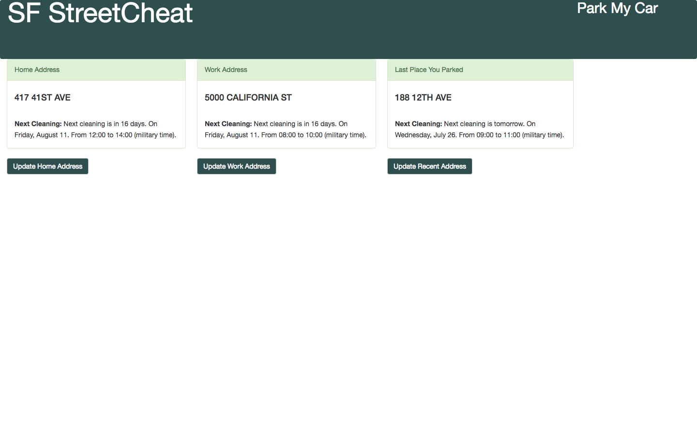

# SF StreetCheat
SF StreetCheat is a 4 week project that I completed during my time as a software engineering fellow at Hackbright Academy. It is designed to help San Francisco residents avoid expensive parking tickets. With street cleaning happening at different times on different streets, different blocks, and even different sides of the same block, it can be difficult to remember when you need to move your car. Even if you do check the signs, you can get distracted and forget to move it in time. SF StreetCheat uses the data provided by DataSF through the Soda API, along with the Goggle Maps, SendGrid,  and Twilio APIs to not only show users how long they have until street cleaning, but also to send them texts or emails reminding them to move their car before street cleaning time. This way they can go about their day or week knowing they won't return to their car only to face a hefty ticket. SF StreetCheat also helps users find nearby streets that have street cleaning times that better fit their needs.

## Contents
* [Technologies](#technologies)
* [Database Model](#database-model)
* [Features](#features)
* [Installation](#install)
* [Testing](#testing)

## <a name="technologies"></a>Technologies
<b>Backend:</b> Python, Flask, PostgreSQL, SQLAlchemy<br/>
<b>Frontend:</b> JavaScript, jQuery, AJAX, Jinja2, Bootstrap, HTML5, CSS3<br/>
<b>APIs:</b> SODA, SendGrid, Twilio, Google Maps<br/>

## <a name="database-model"></a>Database Model


## <a name="features"></a>Features
Users can choose to log in or begin using the site


Their current location is autofilled, and they can confirm or fill in another


The sides of the street that match their location are filled into the drop down for them to choose from


They get information about street cleaning and towing


They can search for information about other street cleaning locations in their neighborhood



And filter those locations to match their needs


Once they log in


They can receive text reminders


Or check on favorite or recent locations



## <a name="install"></a>Installation
To run SF StreetCheat:

Install PostgreSQL (Mac OSX)

Clone or fork this repo:

```
https://github.com/KSaryan/SF-Street-Cheat
```

Create and activate a virtual environment inside your SF StreetCheat directory:

```
virtualenv env
source env/bin/activate
```

Install the dependencies:

```
pip install -r requirements.txt
```
Sign up to use the SendGrid API (https://www.twilio.com/try-twilio)
Sign up to use the Twilio API (https://app.sendgrid.com/signup)

Save your API key in a file called <kbd>secrets.sh</kbd> using this format:
```
export TWILIO_ACCOUNT_SID="YOUR_ACCOUNT_SID_GOES_HERE"
export TWILIO_AUTH_TOKEN="YOUR_AUTH_TOKEN_GOES_HERE"
export TWILIO_NUMBER="YOUR_NUMBER_GOES_HERE"
export SENDGRID_API_KEY="YOUR_API_KEY_GOES_HERE"
```

Source your keys from your secrets.sh file into your virtual environment:

```
source secrets.sh
```

Set up the database:

```
python model.py
```
```
python seed.py
``` 

Run the app:

```
python server.py
```

You can now navigate to 'localhost:5000/' to access SF StreetCheat.


## <a name="testing"></a> Testing
To run tests:

Set up tests database:

```
createdb testdb
```

Run the tests:

```
python tests.py
```

